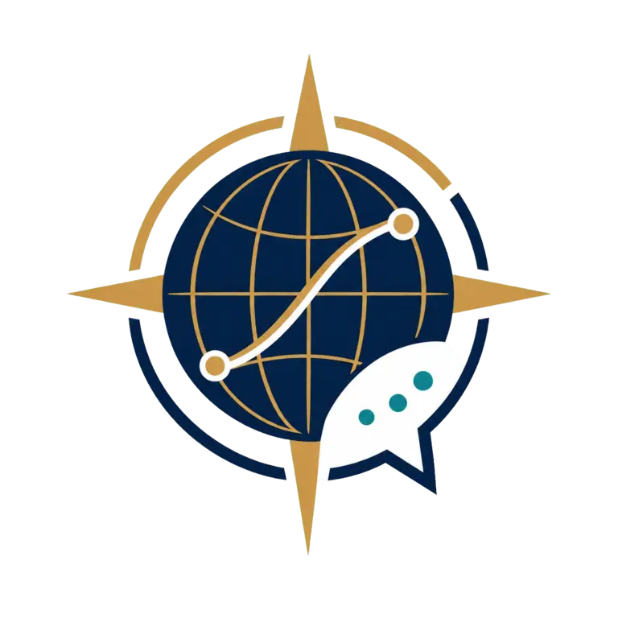
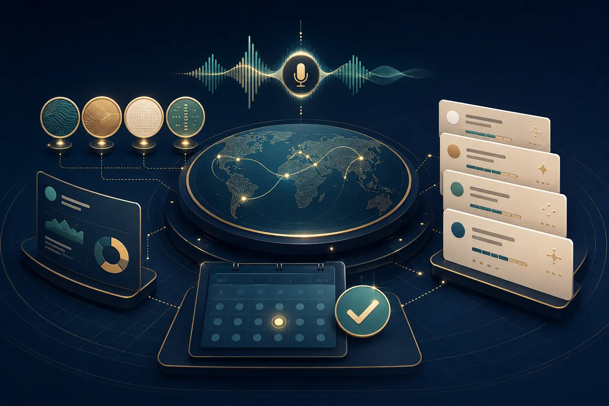

# Sofia Atlas Travel

[](https://github.com/AhmadOthmann/Sofia-Atlas-Travel/actions/workflows/ci.yml)

Sofia Atlas Travel is a self-contained demo product built for the HappyRobot challenge at the TUM.ai Makeathon. It combines a published voice qualification workflow with an operator dashboard, Mission Control ingestion, callback capture, and consultation booking.

## Current status

The dashboard is runnable and production-buildable. It supports two data modes:

- Demo mode uses realistic local fixtures and requires no credentials.
- Live mode reads dashboard state from a configured HappyRobot endpoint.

The supplied HappyRobot export confirms a published v1 inbound voice workflow with a multilingual, memory-enabled agent, 14-field qualification extraction, and outcome routing. The application now supplies demo endpoints that replace the original webhook and booking placeholders. Deployment only requires substituting the public base URL and shared webhook secret in HappyRobot.

## Quick start

Requirements: Node.js 20 or newer and npm.

```bash
npm ci
cp .env.example .env.local
npm run dev
```

Open `http://localhost:3000`.

For a production check:

```bash
npm run lint
npm run build
npm start
```

## HappyRobot configuration

Set these values in `.env.local`:

```dotenv
HAPPYROBOT_TWINDB_BASE_URL=https://api.happyrobot.ai
HAPPYROBOT_TWINDB_API_KEY=your_server_side_key
HAPPYROBOT_TWINDB_DASHBOARD_ENDPOINT=/dashboard/live
HAPPYROBOT_TWINDB_ALLOWED_ENDPOINTS=/dashboard/live
HAPPYROBOT_TWINDB_AUTH_HEADER=Authorization
HAPPYROBOT_TWINDB_AUTH_SCHEME=Bearer
```

The API key is only read on the server. Never prefix it with `NEXT_PUBLIC_` and never commit `.env.local`.

See [docs/HAPPYROBOT_SETUP.md](docs/HAPPYROBOT_SETUP.md) for the expected payload and workflow mapping.
See [docs/HAPPYROBOT_DEMO_CONFIG.md](docs/HAPPYROBOT_DEMO_CONFIG.md) for the exact demo URLs and headers.

## Challenge coverage

| Requirement | Evidence | Status |
| --- | --- | --- |
| User-facing product | Dashboard, leads, calls, chat, drafts, analytics | Implemented |
| Conversation visibility | Transcript and conversation views | Implemented with demo data |
| Pipeline tracking | Lead stages and funnel views | Implemented with demo data |
| Agent observability | Agent status and coaching prompts | Implemented with demo data |
| Persistent agent state | HappyRobot memory enabled and live endpoint adapter | Partial |
| Autonomous qualification | Voice workflow plus 14-field extraction and routing | Implemented |
| Omnichannel execution | Voice plus email actions; no live SMS, WhatsApp, or chat workflow | Partial |
| Meeting or sale completion | Included consultation booking page and confirmation API | Implemented for demo |
| Human takeover | Control concept shown; live takeover action is not wired | Partial |

## Repository structure

```text
app/                         Next.js pages and server routes
components/                  Dashboard UI components
lib/                         HappyRobot adapter, schemas, and demo data
public/                      Static assets
docs/                        Architecture, setup, demo, and audit notes
```

## Security

- HappyRobot credentials stay server-side.
- The server proxy accepts only `GET` and `POST`.
- Proxy destinations must be explicitly allowlisted.
- Caller-provided headers cannot override authentication.
- Upstream requests time out after 10 seconds.
- Live payloads are schema-validated before the UI consumes them.
- HappyRobot webhook and callback routes use a timing-safe shared-secret check.

## Demo storage

Local demo events are stored in `.data/sofia-atlas-demo.json`. On Vercel, the default is temporary `/tmp` storage, which can reset between cold starts. This is appropriate for a short hackathon demonstration. For durable production use, replace the store with a managed database.

## HappyRobot workflow evidence

- Workflow: Sofia, Atlas Travel Concierge
- Version: v1, published
- Trigger: inbound phone call
- Languages: English, Spanish, French, and German
- Memory: enabled
- Routing outcomes: consultation, itinerary, callback, or no outcome
- Included demo destinations: Mission Control webhook, callback API, and consultation booking page

## Documentation

- [Architecture](docs/ARCHITECTURE.md)
- [HappyRobot setup](docs/HAPPYROBOT_SETUP.md)
- [HappyRobot demo configuration](docs/HAPPYROBOT_DEMO_CONFIG.md)
- [Demo script](docs/DEMO_SCRIPT.md)
- [Completion audit](docs/COMPLETION_AUDIT.md)

## Brand assets

The compass and conversation emblem is the primary Atlas Travel identity. The repository includes three generated visuals under `public/brand`:

- `atlas-logo-compass.webp` as the primary product logo
- `atlas-logo-monogram.webp` as an alternate compact mark
- `atlas-project-cover.webp` for portfolio cards and project documentation

| Primary compass logo | Alternate monogram |
| --- | --- |
|  |  |



## License

No license has been selected. Add one before accepting external contributions or reuse.
